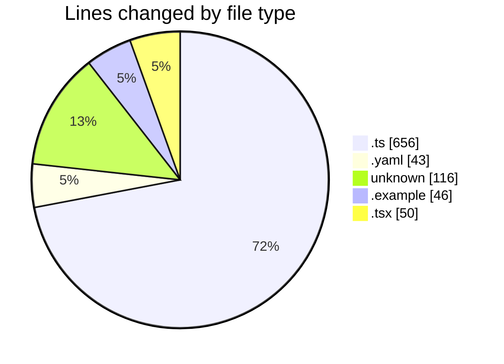
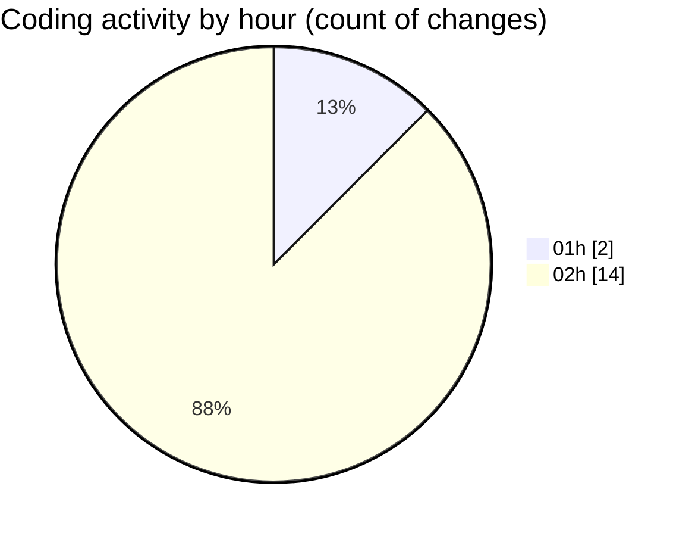

# open-health - Activity Summary 

## Overall Statistics

| Stat                   | Value                                                             |
| ---------------------- | ----------------------------------------------------------------- |
| **Lines Added** (➕)   | 704                                          |
| **Lines Removed** (➖) | 207                                        |
| **Net Change** (↕)    | 497                |
| **Active Time** (⌚)   | 12 minutes |

## Modified Files
- **docling.ts** (+2, -31)
- **docker-compose.yaml** (+0, -43)
- **.env** (+49, -0)
- **.env.example** (+46, -0)
- **Containerfile** (+44, -23)
- **middleware.ts** (+22, -0)
- **pdf.ts** (+438, -57)
- **route.ts** (+28, -3)
- **upstage.ts** (+75, -0)
- **source-add-screen.tsx** (+0, -50)

## Visualizations

### By File Type (Lines Changed)

### By Hour (Estimated Activity Count)

> **Last Updated:** 10/1/2025, 2:09:17 AM