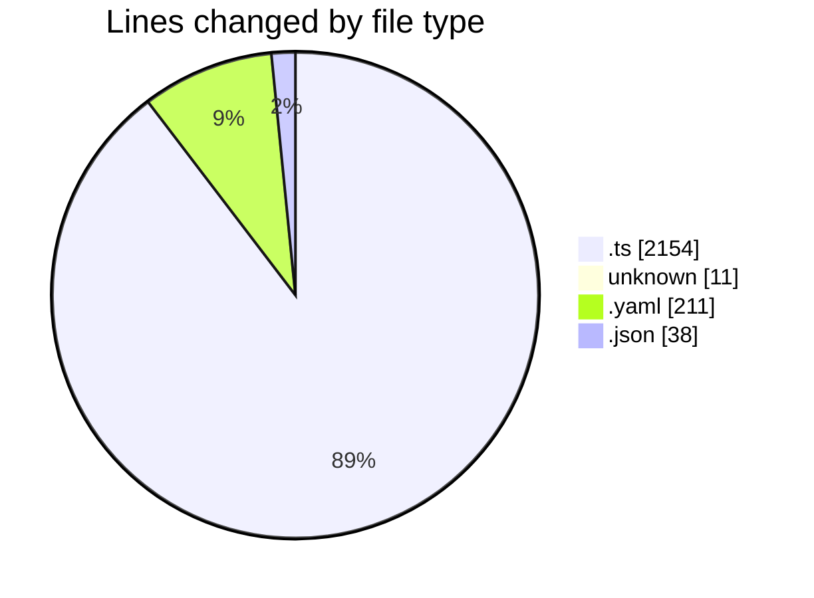
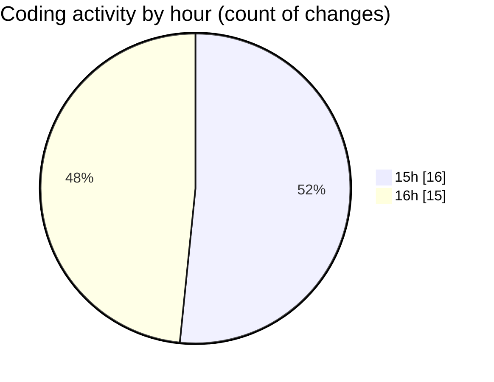

# oura-api - Activity Summary 

## Overall Statistics

| Stat                   | Value                                                             |
| ---------------------- | ----------------------------------------------------------------- |
| **Lines Added** (➕)   | 2414                                          |
| **Lines Removed** (➖) | 0                                        |
| **Net Change** (↕)    | 2414                |
| **Active Time** (⌚)   | 37 minutes |

## Modified Files
- **get-today-oura.ts** (+105, -0)
- **.gitignore** (+11, -0)
- **generate_methods_matrix.ts** (+409, -0)
- **full-oauth-server.ts** (+412, -0)
- **TASK-101-refactor-lib-structure.task.yaml** (+107, -0)
- **TASK-102-refactor-cli-today.task.yaml** (+104, -0)
- **Oura.ts** (+66, -0)
- **oauth.ts** (+121, -0)
- **OuraOAuth.ts** (+139, -0)
- **time.ts** (+28, -0)
- **normalize.ts** (+57, -0)
- **time.ts** (+3, -0)
- **file.ts** (+18, -0)
- **Oura.ts** (+3, -0)
- **OuraBase.ts** (+773, -0)
- **cli.ts** (+17, -0)
- **package.json** (+17, -0)
- **tsconfig.json** (+21, -0)
- **utilsOAuth.ts** (+3, -0)

## Visualizations

### By File Type (Lines Changed)

### By Hour (Estimated Activity Count)

> **Last Updated:** 10/1/2025, 4:21:36 PM