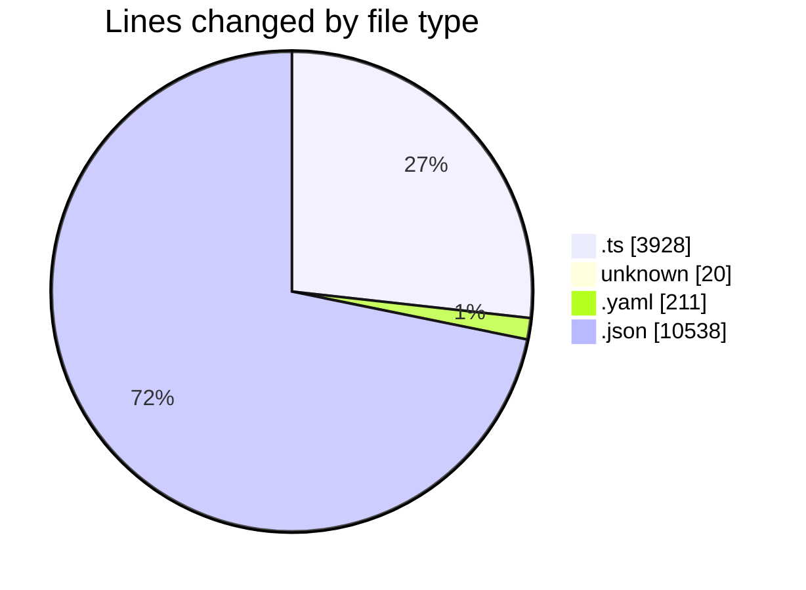
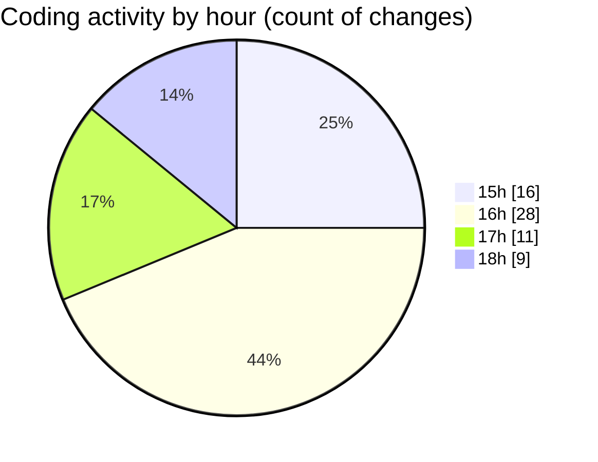

# oura-api - Activity Summary 

## Overall Statistics

| Stat                   | Value                                                             |
| ---------------------- | ----------------------------------------------------------------- |
| **Lines Added** (➕)   | 12843                                          |
| **Lines Removed** (➖) | 1854                                        |
| **Net Change** (↕)    | 10989                |
| **Active Time** (⌚)   | 84 minutes |

## Modified Files
- **get-today-oura.ts** (+105, -726)
- **.gitignore** (+16, -4)
- **generate_methods_matrix.ts** (+409, -0)
- **full-oauth-server.ts** (+412, -0)
- **TASK-101-refactor-lib-structure.task.yaml** (+107, -0)
- **TASK-102-refactor-cli-today.task.yaml** (+104, -0)
- **Oura.ts** (+66, -0)
- **oauth.ts** (+150, -0)
- **OuraOAuth.ts** (+139, -0)
- **time.ts** (+28, -0)
- **normalize.ts** (+57, -0)
- **time.ts** (+3, -0)
- **file.ts** (+18, -0)
- **Oura.ts** (+4, -0)
- **OuraBase.ts** (+773, -0)
- **cli.ts** (+17, -0)
- **package.json** (+21, -0)
- **tsconfig.json** (+29, -1)
- **utilsOAuth.ts** (+3, -0)
- **personal.ts** (+9, -0)
- **activity.ts** (+16, -0)
- **readiness.ts** (+16, -0)
- **stress.ts** (+16, -0)
- **heartrate.ts** (+44, -0)
- **workouts.ts** (+16, -0)
- **spo2.ts** (+16, -0)
- **format.ts** (+296, -0)
- **today.ts** (+205, -0)
- **args.ts** (+40, -0)
- **today.ts** (+85, -0)
- **oura-today-2025-10-01-Europe-Madrid.json** (+6007, -1123)
- **mod.ts** (+16, -0)
- **oura_sandbox_test.ts** (+94, -0)
- **oura-heartrate-2025-10-01-Europe-Madrid.json** (+3357, -0)
- **utils.time.test.ts** (+25, -0)
- **cli.args.test.ts** (+20, -0)
- **presenters.format.test.ts** (+22, -0)
- **api.oauth.test.ts** (+33, -0)
- **ouraBase.retry.test.ts** (+24, -0)
- **services.today.test.ts** (+25, -0)

## Visualizations

### By File Type (Lines Changed)

### By Hour (Estimated Activity Count)

> **Last Updated:** 10/1/2025, 6:12:37 PM