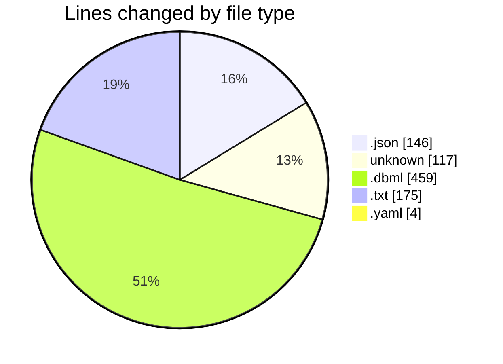
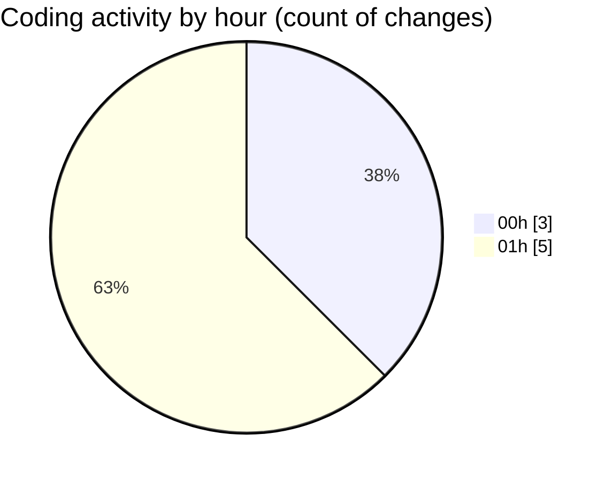

# oura-api - Activity Summary 

## Overall Statistics

| Stat                   | Value                                                             |
| ---------------------- | ----------------------------------------------------------------- |
| **Lines Added** (➕)   | 900                                          |
| **Lines Removed** (➖) | 1                                        |
| **Net Change** (↕)    | 899                |
| **Active Time** (⌚)   | 11 minutes |

## Modified Files
- **settings.json** (+140, -1)
- **extensions.json** (+5, -0)
- **.cursorrules** (+117, -0)
- **oura-ml-extensions.dbml** (+459, -0)
- **LAUNCH-T01.txt** (+175, -0)
- **pnpm-workspace.yaml** (+4, -0)

## Visualizations

### By File Type (Lines Changed)

### By Hour (Estimated Activity Count)

> **Last Updated:** 10/2/2025, 1:24:54 AM