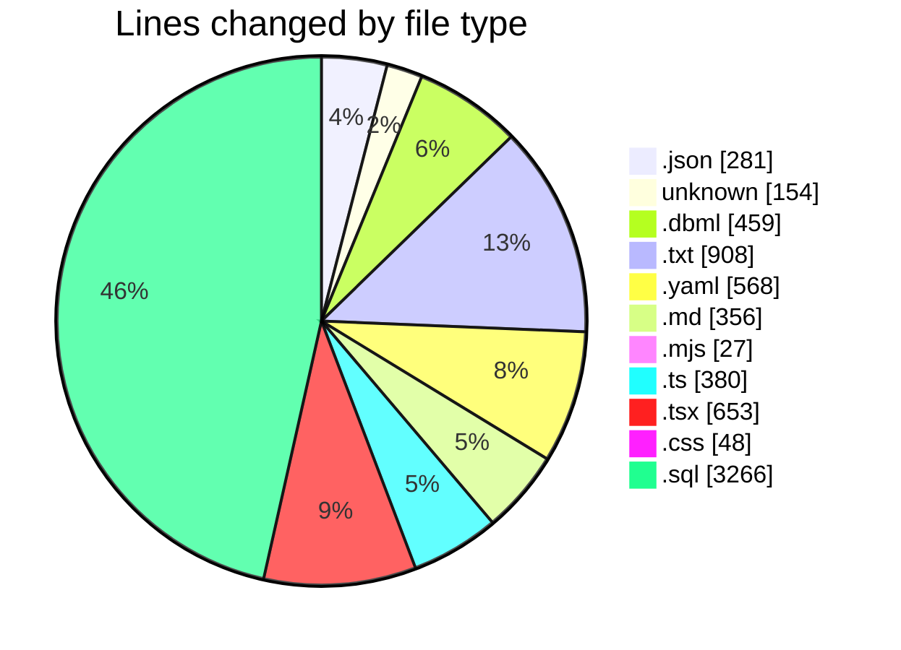
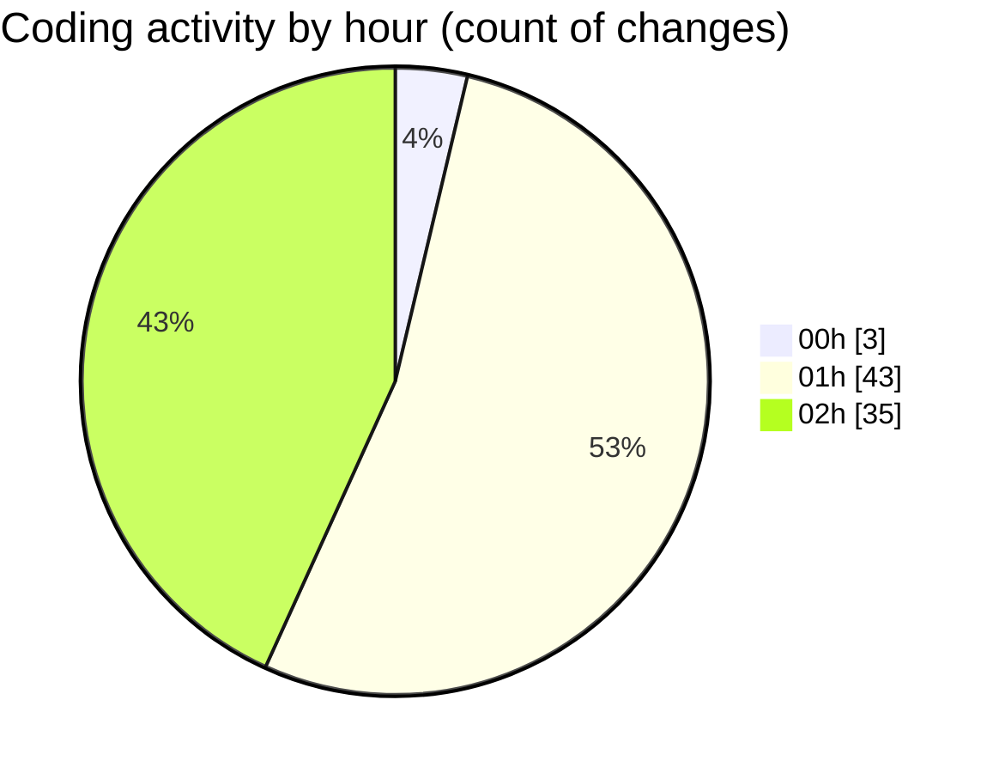

# oura-api - Activity Summary 

## Overall Statistics

| Stat                   | Value                                                             |
| ---------------------- | ----------------------------------------------------------------- |
| **Lines Added** (➕)   | 6803                                          |
| **Lines Removed** (➖) | 297                                        |
| **Net Change** (↕)    | 6506                |
| **Active Time** (⌚)   | 121 minutes |

## Modified Files
- **settings.json** (+140, -1)
- **extensions.json** (+5, -0)
- **.cursorrules** (+117, -0)
- **oura-ml-extensions.dbml** (+459, -0)
- **LAUNCH-T01.txt** (+175, -0)
- **pnpm-workspace.yaml** (+4, -0)
- **package.json** (+47, -1)
- **tsconfig.json** (+31, -2)
- **FINAL_ANSWER_CROSS_DOMAIN.md** (+356, -0)
- **next.config.mjs** (+16, -0)
- **tailwind.config.ts** (+49, -0)
- **postcss.config.mjs** (+11, -0)
- **.eslintrc.json** (+5, -0)
- **.gitignore** (+37, -0)
- **layout.tsx** (+38, -0)
- **page.tsx** (+20, -0)
- **globals.css** (+48, -0)
- **package.json** (+27, -0)
- **components.json** (+22, -0)
- **utils.ts** (+8, -0)
- **card.tsx** (+81, -0)
- **button.tsx** (+58, -0)
- **badge.tsx** (+38, -0)
- **separator.tsx** (+33, -0)
- **skeleton.tsx** (+17, -0)
- **tooltip.tsx** (+32, -0)
- **index.ts** (+10, -0)
- **dashboard.ts** (+33, -0)
- **TASK-201-deploy-postgresql-schema.task.yaml** (+159, -0)
- **TASK-202-normalize-contributors.task.yaml** (+199, -0)
- **TASK-203-etl-pipeline-oura-to-db.task.yaml** (+206, -0)
- **oura-api.d.ts** (+209, -33)
- **TASK-201-PROMPT.txt** (+152, -0)
- **generate-sql.ts** (+38, -0)
- **oura_base.sql** (+736, -83)
- **001_create_heartrate_partitions.sql** (+88, -16)
- **002_seed_test_data.sql** (+236, -0)
- **003_validate_schema.sql** (+138, -11)
- **004_test_queries_performance.sql** (+122, -12)
- **LAUNCH-T02.txt** (+402, -0)
- **TASK-202-PROMPT.txt** (+179, -0)
- **005_create_contributors_tables.sql** (+300, -0)
- **006_migrate_jsonb_to_normalized.sql** (+285, -32)
- **007_create_triggers.sql** (+335, -28)
- **008_create_enriched_views.sql** (+341, -40)
- **009_validate_task202.sql** (+425, -38)
- **providers.tsx** (+23, -0)
- **Sidebar.tsx** (+92, -0)
- **MobileHeader.tsx** (+33, -0)
- **MobileSidebar.tsx** (+103, -0)
- **DateSelector.tsx** (+40, -0)
- **DashboardGrid.tsx** (+45, -0)

## Visualizations

### By File Type (Lines Changed)

### By Hour (Estimated Activity Count)

> **Last Updated:** 10/2/2025, 2:32:54 AM