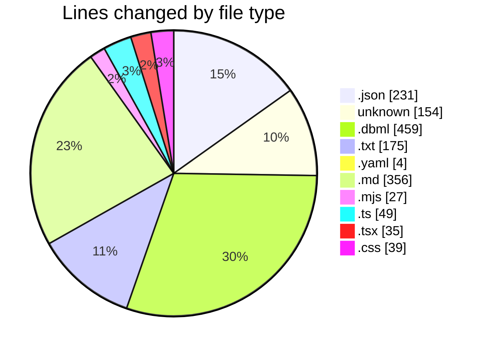
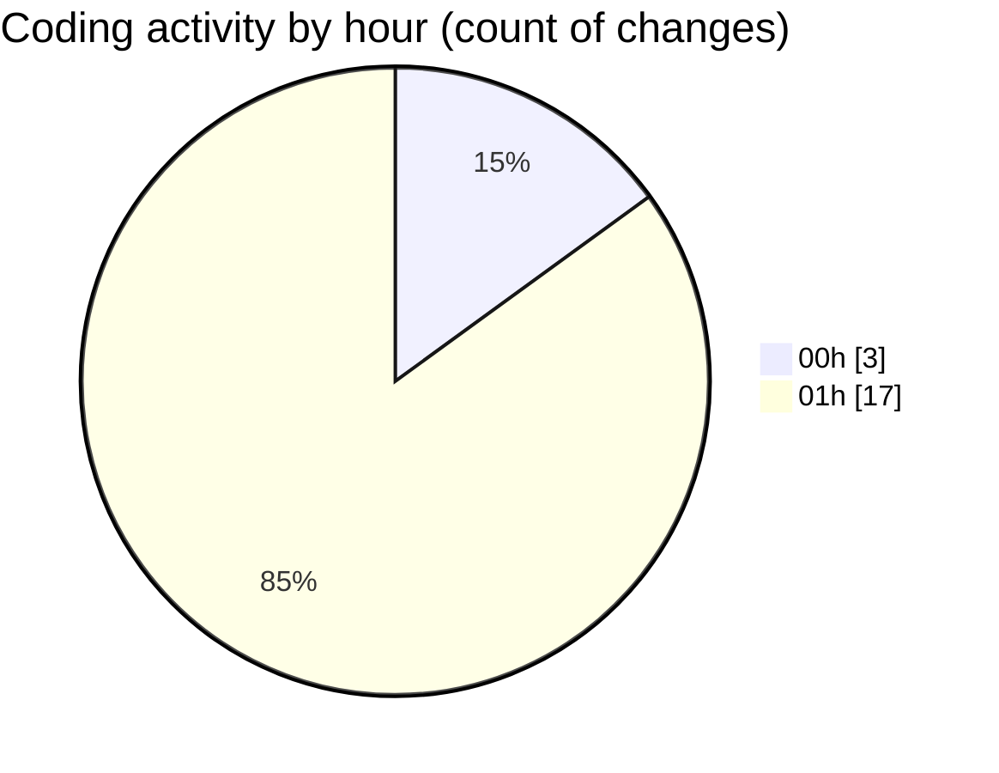

# oura-api - Activity Summary 

## Overall Statistics

| Stat                   | Value                                                             |
| ---------------------- | ----------------------------------------------------------------- |
| **Lines Added** (➕)   | 1528                                          |
| **Lines Removed** (➖) | 1                                        |
| **Net Change** (↕)    | 1527                |
| **Active Time** (⌚)   | 24 minutes |

## Modified Files
- **settings.json** (+140, -1)
- **extensions.json** (+5, -0)
- **.cursorrules** (+117, -0)
- **oura-ml-extensions.dbml** (+459, -0)
- **LAUNCH-T01.txt** (+175, -0)
- **pnpm-workspace.yaml** (+4, -0)
- **package.json** (+29, -0)
- **tsconfig.json** (+29, -0)
- **FINAL_ANSWER_CROSS_DOMAIN.md** (+356, -0)
- **next.config.mjs** (+16, -0)
- **tailwind.config.ts** (+49, -0)
- **postcss.config.mjs** (+11, -0)
- **.eslintrc.json** (+5, -0)
- **.gitignore** (+37, -0)
- **layout.tsx** (+21, -0)
- **page.tsx** (+14, -0)
- **globals.css** (+39, -0)
- **package.json** (+22, -0)

## Visualizations

### By File Type (Lines Changed)

### By Hour (Estimated Activity Count)

> **Last Updated:** 10/2/2025, 1:26:54 AM