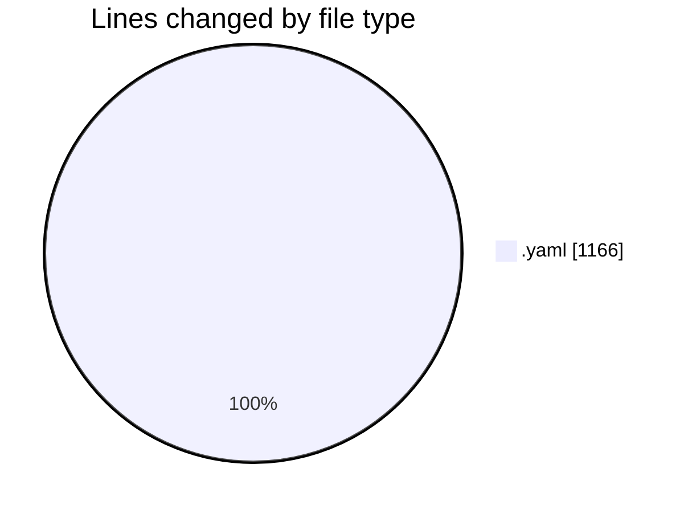
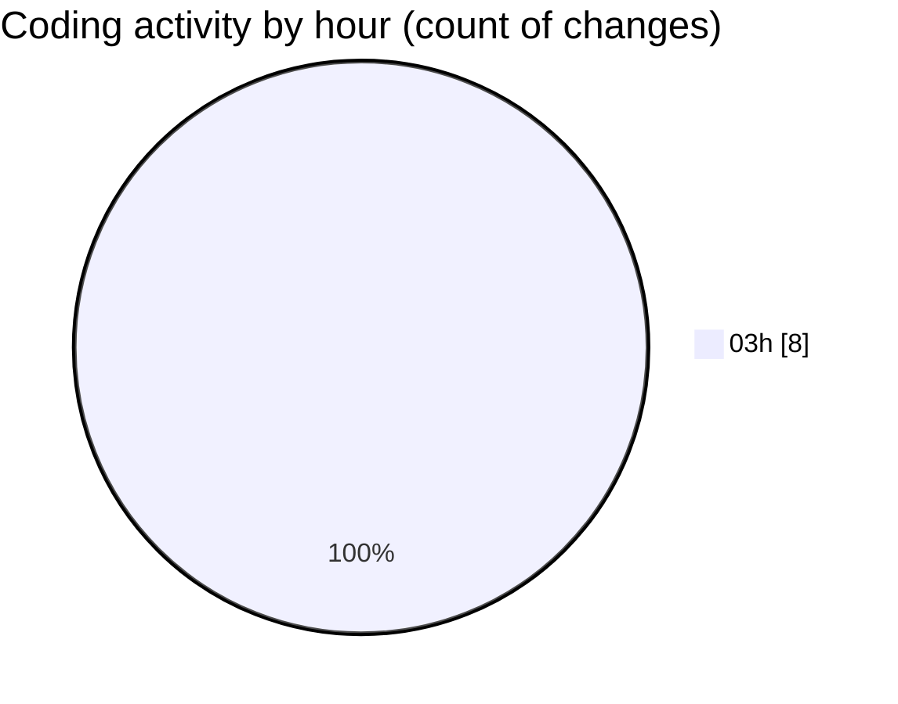

# API-Hub - Activity Summary 

## Overall Statistics

| Stat                   | Value                                                             |
| ---------------------- | ----------------------------------------------------------------- |
| **Lines Added** (➕)   | 1166                                          |
| **Lines Removed** (➖) | 0                                        |
| **Net Change** (↕)    | 1166                |
| **Active Time** (⌚)   | 7 minutes |

## Modified Files
- **TASK-001-bootstrap-monorepo.task.yaml** (+138, -0)
- **TASK-002-sso-rbac-keycloak.task.yaml** (+141, -0)
- **TASK-003-apicurio-studio-registry.task.yaml** (+146, -0)
- **TASK-004-microcks-mocks-tests.task.yaml** (+146, -0)
- **TASK-005-docs-portal-scalar.task.yaml** (+140, -0)
- **TASK-006-lint-diff-quality.task.yaml** (+143, -0)
- **TASK-007-policies-conftest-opa.task.yaml** (+150, -0)
- **TASK-008-higress-gateway-console.task.yaml** (+162, -0)

## Visualizations

### By File Type (Lines Changed)

### By Hour (Estimated Activity Count)

> **Last Updated:** 10/9/2025, 3:06:17 AM